# Don't Touch Page One

*How AI coding agents stay cheap by never editing what they've already sent: prompt caching in opencode, pi, Codex CLI and DeepSeek Harness*

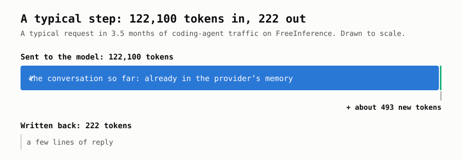

Researchers studied 3.5 months of coding-agent traffic on FreeInference, a public AI service ([Juncheng Yang, 2026](https://x.com/1a1a11a/status/2104268386049949717)). In a typical request, the agent sent the model **122,100 tokens** and got just **222** back. Typically only about **493** of the tokens it sent were new. Everything else was the same conversation, sent again.

That sounds wasteful, and without one trick it would be. The trick is **prompt caching**: the AI provider remembers text it has just read and charges a fraction of the price to read it again. In that study, those cheap re-reads were the biggest single item on most sessions' bills. The researchers' conclusion: *"your agent's cost is determined by cache reads."*

So whether a coding tool uses this memory well decides how much you pay and how fast it answers. Used well, 95–99% of what it sends comes from memory. Used badly, a single changed date near the top can make you pay full price for 100,000 tokens on every step. As you'll see, it all comes down to one rule: **don't touch page one.**

This post covers:

1. **How the memory works.** No background needed.
2. **What four open-source coding tools do about it.** Taken from their source code, not their marketing.
3. **What real-world numbers show.**

> **A few words used below**
> - **Model:** the AI itself, such as Claude, GPT or DeepSeek.
> - **Provider:** the company running the model and billing you for it.
> - **Token:** the unit models read and write, roughly ¾ of a word. Pricing is per million tokens.
> - **Harness:** the coding app wrapped around the model (opencode, pi, Codex CLI, DeepSeek Harness, Claude Code). It decides exactly what gets sent to the model.
> - **Cache:** the provider's short-term memory of text it has recently read.

---

## Part 1: How the memory works

### A coding agent re-sends everything, every step

When you ask a coding agent to "fix the failing test", it doesn't answer in one go. It works in steps: read a file, run the tests, edit something, run the tests again. Models don't remember between requests, so at every step the harness sends the **entire** conversation so far, plus the newest result.

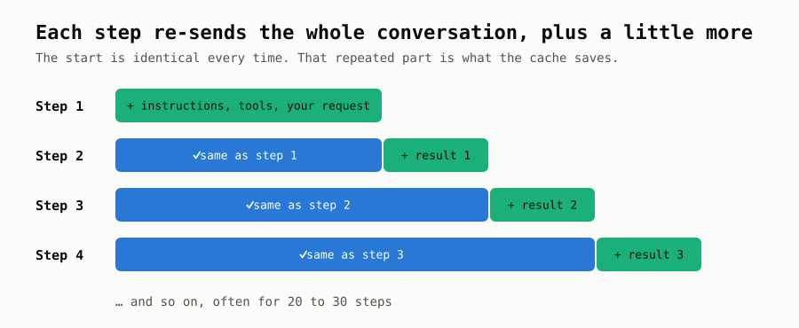

A real task can take 20 to 30 of these steps. Almost everything in each one is a repeat. The blue part is what caching can save.

### The memory only works from the start

Picture the conversation as a stack of pages that the model always reads from page 1. When a new request arrives, the provider checks it page by page against what it read last time. **As long as the pages match from the beginning, it can skip them.** At the first page that differs, it has to start reading properly again, and it reads everything after that point too, even pages identical to last time.

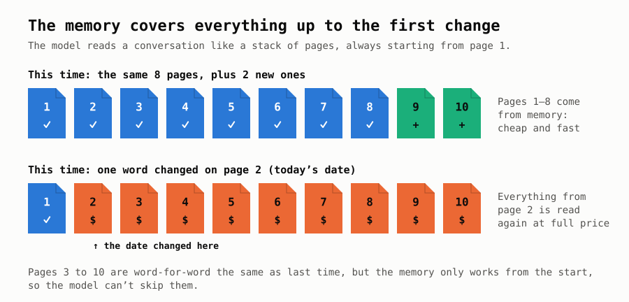

This one rule explains almost everything else in this post:

> **The memory covers everything up to the first change. After that, you pay full price.**

Change the date on page 2 and you lose the memory for the whole conversation. Add a new page at the end and you keep all of it.

### Why it matters for your bill

Take DeepSeek's prices. Reading text the provider already remembers costs **$0.006** per million tokens. Reading it fresh costs **$0.30**, which is 50 times more.

Now picture an agent working through 30 steps, re-sending a 100,000-token conversation each time. That's 3 million tokens of re-reading:

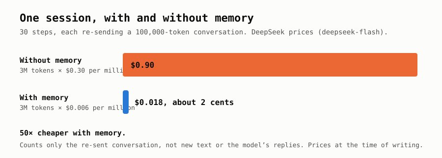

Same work, same answer, 50 times cheaper. Prices are from [DeepSeek's pricing page](https://api-docs.deepseek.com/quick_start/pricing) for its deepseek-flash model at the time of writing. Other providers discount less, but the idea is the same everywhere.

### Two kinds of memory

Providers offer this memory in two ways:

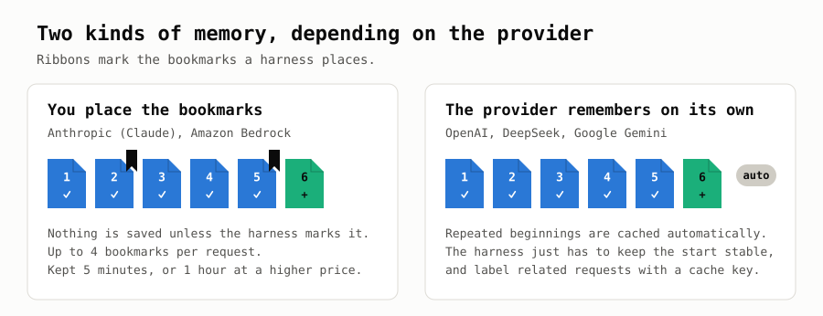

- **You place bookmarks** (Claude, Amazon Bedrock). Nothing is saved unless the harness marks a spot saying "save everything up to here". It can place up to 4 per request. Entries last 5 minutes, and each use resets the clock. A 1-hour option costs more.
- **Automatic** (OpenAI, DeepSeek, Google Gemini). The provider notices repeated beginnings on its own. The harness only has to keep the start of each request the same. With OpenAI it should also label related requests with a **cache key**, so they reach the same machine. OpenAI reports that one coding customer went from 60% to 87% of input served from memory just by adding that label.

### The memory lives on one machine

A provider runs thousands of machines, and the memory sits on whichever one handled your last step. If your next step goes to a different machine, that machine has nothing remembered and starts from scratch, even if your request is perfect.

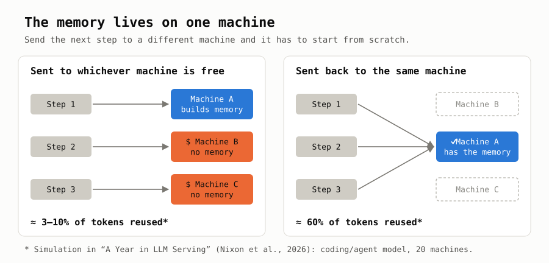

"A Year in LLM Serving" ([Nixon et al., 2026](https://arxiv.org/pdf/2608.13573)) studied 6.1 billion requests on Chutes, a service that hosts open models. In its simulation, sending steps to whichever machine was free reused only about 3–10% of tokens. Sending each step back to the machine that held its memory reused about 60%. The same paper found that 99% of a user's follow-up requests arrive within 15 minutes, so a few minutes of memory covers nearly everything.

That's why harnesses attach a session label to every request, and why services that bounce one conversation between several providers lose hits.

### What a harness can control

1. **Bookmarks:** where to place them.
2. **Labels:** so steps reach the machine that remembers.
3. **How long to remember:** 5 minutes, 1 hour, 24 hours.
4. **Keeping the start fixed:** no dates, folder paths or reloaded files near the top.
5. **Handling changes:** what happens when tools, instructions or the model change mid-conversation.
6. **Keeping the memory alive:** across long pauses.
7. **Compaction:** whether summarising an old conversation can reuse the memory.

---

## Part 2: How four coding tools handle it

We read the source code of four open-source harnesses as it stood at the time of writing (October 2026). They change quickly, so details may have moved on since.

| Harness | Who makes it |
|---|---|
| **opencode** | the opencode team |
| **pi** | Mario Zechner |
| **Codex CLI** | OpenAI |
| **DeepSeek Harness** | DeepSeek |

The biggest difference between them is what happens **when something changes mid-conversation**. The date rolls over, you switch folders, you turn a tool on, or you edit your project's instructions file. A harness can either rewrite the start of the conversation, or leave it alone and add a note at the end:

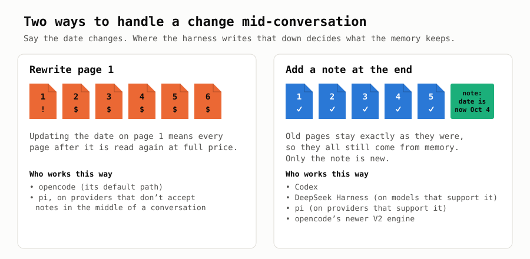

### opencode: placing the bookmarks well

**Bookmarks.** opencode's default path places bookmarks on its instructions and on **the two newest messages**. Those two move forward every step, so each step reuses what the previous one saved. A newer, experimental engine places them on the tools, the instructions and **your latest message** instead. That leaves the agent's own back-and-forth after your message without a bookmark, so it is sent again at full price on every step until you write again.

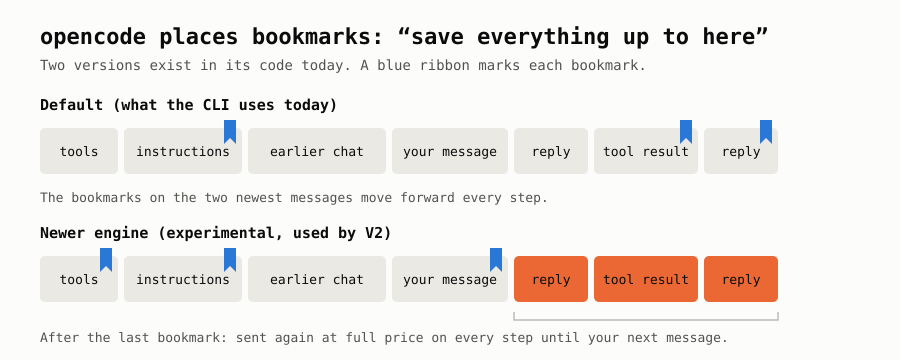

**Labels.** opencode attaches the session's id to every request, as a cache key for OpenAI-style providers and as a header for the rest.

**Things that change the start.** opencode rebuilds its instructions from scratch on every step, and they include today's date. When the date changes at midnight, the whole conversation drops out of memory. It also reloads your project's instruction files every step. If one of those is a web link that fails to load within 5 seconds, that section silently disappears for that step, which also changes the start.

**The toolbox.** opencode also rebuilds the **toolbox**, the list of actions the model may take, on every step. On Claude the toolbox comes first in the request, so any change to it means re-reading everything:

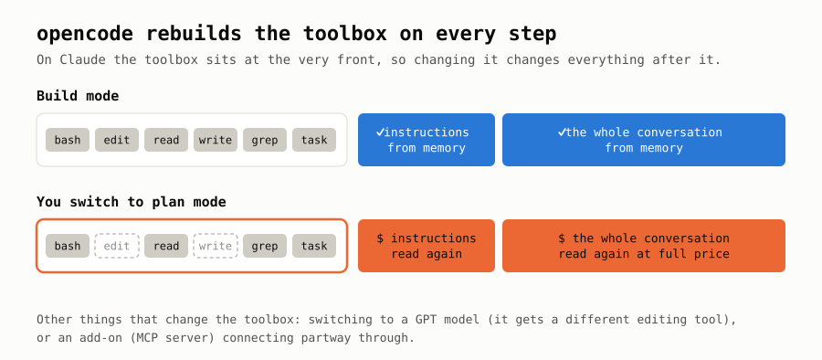

Switching between "plan" and "build" mode, switching to a GPT model or an add-on connecting partway through all change the toolbox. opencode has no way to add or remove a tool later in the conversation.

opencode's history shows the team steadily removing text that changes:

| Date | Change |
|---|---|
| Feb 2026 | Web search tool: "Today's date is …" became "The current year is …", *"to avoid cache busts"* |
| Mar 2026 | Terminal tool: stopped naming the current folder |
| Apr 2026 | The folder name had crept back in, so it was removed again |
| Apr 2026 | Clearing out old tool results, which rewrites old messages, made opt-in |
| May 2026 | Tools always listed in the same alphabetical order |

**What's next.** opencode's newer V2 engine freezes the starting instructions. Later changes, such as a new date, are added at the end as notes ("Today's date is now: …"). It isn't the default yet.

<details>
<summary>For the technically curious: opencode code</summary>

Default bookmarks: the first two system messages and the last two other messages.

```ts
const system = msgs.filter((msg) => msg.role === "system").slice(0, 2)
const final = msgs.filter((msg) => msg.role !== "system").slice(-2)
```

The date in the system prompt:

```ts
`  Today's date: ${new Date().toDateString()}`,
```

Tools hidden in plan mode: a tool whose permission rule denies everything is removed from the request entirely.

```ts
return rule?.pattern === "*" && rule.action === "deny"
```

The experimental engine (also used by V2) defaults to `{ tools: true, system: true, messages: "latest-user-message" }`. Cache keys: `promptCacheKey = sessionID` for OpenAI, Azure, xAI, Mistral and a few others, plus `x-session-affinity` / `X-Session-Id` headers.
</details>

### pi: using every provider's features

**Bookmarks in layers.** On Claude, pi places separate bookmarks on the toolbox, the instructions and your latest message. Changing the instructions then doesn't throw away the saved toolbox.

**How long to remember.** A single setting (`short` or `long`) is translated into each provider's own option: 1 hour on Claude and Bedrock, 24 hours or 30 minutes on OpenAI.

**The toolbox never shrinks.** When you turn a tool on or off, pi leaves the toolbox at the front exactly as it was and puts an announcement at the end of the conversation instead:

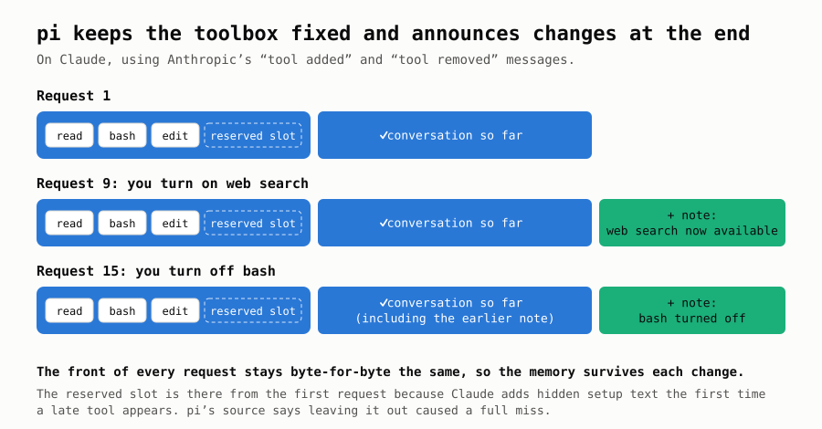

The "reserved slot" exists because Claude quietly adds some setup text the first time a tool is added late. If pi waited until then, that setup text would appear near the front and wipe the memory. So pi reserves the slot from the very first request. Its source code notes they measured a full miss without it.

pi handles changes to instruction files the same way, as notes at the end. Some providers (Google, Bedrock, DeepSeek) don't accept notes in the middle of a conversation, though. With those, pi has to fold the change back into the instructions at the start.

**The cache warmer.** pi is the only one of the four that actively keeps the memory from expiring. Claude forgets after 5 minutes without use, and a long build or test run can easily take longer than that. So pi sends a tiny "ping" just before the deadline, which resets the clock for about the price of one cheap re-read:

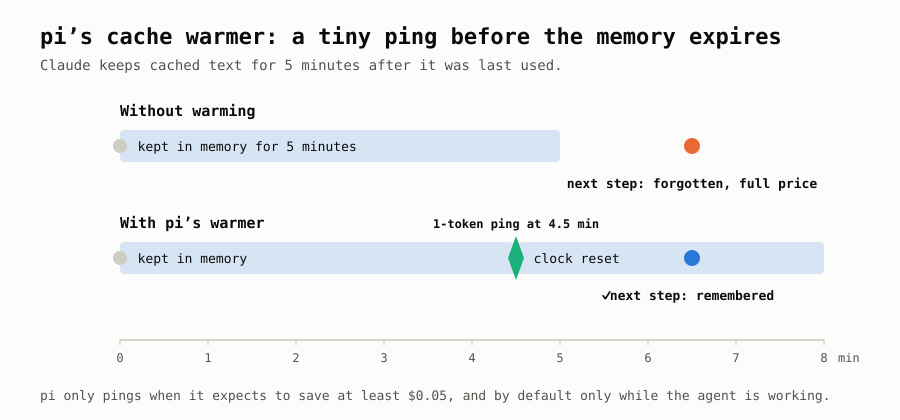

It only pings when it's worth it. pi estimates how likely you are to continue, what a miss would cost and what the ping costs, and only pings if it expects to save at least $0.05. By default it pings only while the agent is working; a setting extends this to the pauses between your messages.

<details>
<summary>For the technically curious: pi code</summary>

The comment explaining the placeholder:

```ts
/**
 * Stable deferred tool declared whenever native tool changes are in use. Anthropic adds
 * hidden prompt scaffolding as soon as any tool has `defer_loading`; declaring this
 * placeholder from the first request keeps that scaffolding in the cached prefix, so the
 * first real late tool does not invalidate the cache (measured: full miss without it).
 */
```

Tool changes go out as Anthropic's `tool_addition` / `tool_removal` blocks, with later tools declared `defer_loading: true`. Retention: `cacheRetention: "none" | "short" | "long"` (or `PI_CACHE_RETENTION=long`). On Anthropic and Bedrock that maps to `ttl: "1h"`; on OpenAI to `prompt_cache_retention: "24h"`, or `prompt_cache_options.ttl: "30m"` on the newest models. The warmer replays the last request with `maxTokens: 1` at `min(0.9 × TTL, TTL − 10s)`:

```
expected saving = P(continue) × (miss cost − hit cost) − warm cost
P(continue)     = 1 while the agent runs, 0.15 when idle ("Measured from our own usage")
```
</details>

### Codex CLI: never edit, only add, and test it

Codex only talks to OpenAI, whose memory is automatic, so it has no bookmarks to place. Everything goes into keeping the start of each request fixed and getting it to the right machine.

**Labels.** Every request carries the session's id as its cache key. Codex deliberately shares that key: helper agents it spawns reuse their parent's key, so they reach the machine that already holds the conversation.

**Changes become notes.** Codex keeps a small card describing your setup: which folder, what it's allowed to do, which model, today's date. When any of that changes, it adds a short note at the end saying only what changed:

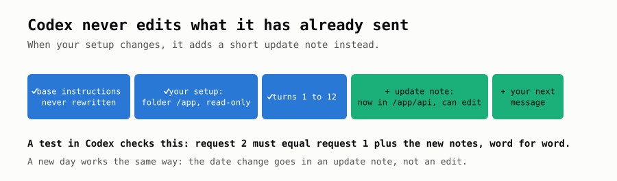

Codex also has an automated test that fails if this ever breaks. After changing the folder and permissions, request 2 must equal request 1 plus the new notes, word for word.

**Small things done carefully.**
- Add-on tools are always listed in the same order, even though they load in random order.
- Internal ids are generated from content, so they come out identical every time.
- The fields of each request are always written in the same order.

**Sending only what's new.** Over a live connection to OpenAI, Codex can skip re-sending the conversation entirely. It says "continue from reply #7" and attaches only the new part:

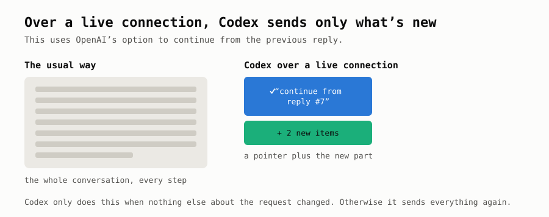

**Gaps.** Codex never asks for a longer memory period. When it summarises old history on your own machine, it leaves the toolbox out, which means that request doesn't match what's in memory.

<details>
<summary>For the technically curious: Codex code</summary>

How the cache key is chosen:

```rust
if let Some(prompt_cache_key) = &self.prompt_cache_key_override { return prompt_cache_key.clone(); }
if let SessionSource::Internal(source) = &self.state.session_source
    && let Some(parent_thread_id) = responses_metadata.parent_thread_id
{ return format!("{source}:{parent_thread_id}"); }
responses_metadata.session_id.clone()
```

Setup changes are appended as JSON merge-patch diffs. Automated tests check both the cache key and that each request extends the previous one. The live-connection path sends `previous_response_id` plus new items only when every other request field is unchanged. The code says: *"Keep the destructuring exhaustive so new request fields require an explicit reuse decision."*
</details>

### DeepSeek Harness: rebuild every request from a diary

DeepSeek's memory is automatic, so DeepSeek Harness places no bookmarks. Its approach is built into how it stores a conversation. Everything that happens goes into a **diary** that is only ever added to, and every request is rebuilt from that diary and then frozen so nothing can alter it.

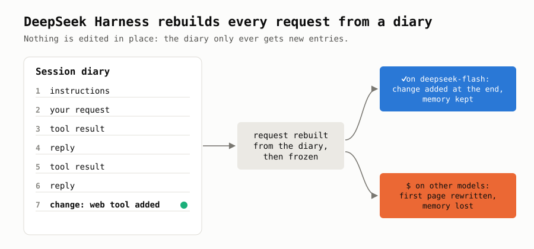

Because nothing is edited, the start of each request stays the same automatically. An automated test with a real DeepSeek account checks that every request after the first gets memory hits.

**The catch.** Adding changes at the end only works on models that declare support. In the default list, only `deepseek-flash` does. On other models, a change to the instructions or tools rewrites the first page. For providers other than DeepSeek, it borrows pi's code, so it gets pi's bookmarks and labels there.

<details>
<summary>For the technically curious: DeepSeek Harness code</summary>

The system prompt is the first entry of a durable event log, and each request is deep-frozen once built. On models that declare `systemPromptUpdate: 'in-history'` and `toolUpdate: 'addition-only'` (only `deepseek-flash` in the default list), changes are sent as mid-history system messages and `tool_addition` blocks. Other providers go through pi's library.
</details>

### Compaction: the problem nobody has solved

**What it is.** A model can only read so much at once. When a conversation gets close to that limit, the harness asks the model to write a short summary of the older part, then carries on with the summary instead of the full history.

**Why it hurts.** Compaction costs twice:

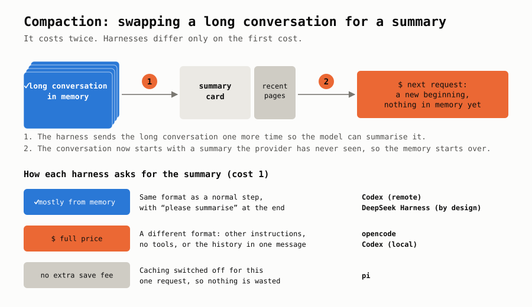

1. **Writing the summary.** The harness has to send the long conversation one more time so the model can summarise it.
2. **Starting over.** The conversation now begins with a summary the provider has never seen, so the memory starts from zero.

Every harness pays the second cost; that's what compaction is. They differ on the first:

- **Ask the same way as a normal step**, with "please summarise" added at the end. The request then matches what's already in memory, so it's cheap. Codex does this when OpenAI does the summarising. DeepSeek Harness is designed to, but it trims old tool results just before, which breaks the match partway through.
- **Ask in a different format**, with other instructions, no tools, or the history pasted into one message. Nothing matches, so the whole conversation is paid at full price. opencode, and Codex when summarising on your own machine, work this way.
- **Switch memory off for that one request.** pi does this on purpose. The summary won't reuse the memory anyway, so pi at least avoids paying to save a summary request that will never be reused.

### All four side by side

| | opencode | pi | Codex CLI | DeepSeek Harness |
|---|---|---|---|---|
| Bookmarks on Claude | instructions + 2 newest messages | toolbox + instructions + your message | n/a (OpenAI only) | via pi's code |
| Session label | yes | yes | yes, shared with helper agents | yes |
| Longer memory option | no | 1 h / 24 h / 30 min | no | via pi's code |
| Text that changes near the start | date, reloaded instruction files | none | none (date goes in a note) | none (folder moved to the end) |
| When instructions change | rewritten (V2: note at the end) | note at the end, or rewritten on some providers | note at the end | note at the end on capable models |
| When tools change | toolbox rebuilt | toolbox fixed, note at the end | toolbox fixed for the session | toolbox fixed on capable models |
| Keeps memory warm | no | yes, cost-aware | no | no |
| Sends only what's new | no | via its Codex connection | yes, over a live connection | no |

---

## Part 3: What the real-world numbers say

Lots of people now publish how much of their input came from memory: from their own logs, from AI services and from benchmarks. The numbers aren't measured identically, so a point or two either way means nothing. A few patterns are clear, though.

**1. When the provider remembers well, most harnesses land at 94–99%.**

- Users report 96–98% for Codex, including one at 97.8% over 11 billion tokens.
- They report 97–99.9% for pi, opencode and DeepSeek Harness on DeepSeek. One DeepSeek Harness user matched 98% against their actual bill.
- They report 95–99% for Claude Code on Claude.

**2. The provider matters as much as the harness.** The same DeepSeek job sent through two different providers on OpenRouter got 60% from memory on one and 97% on the other ([Reddit](https://www.reddit.com/r/openrouter/comments/1wqv5iu/same_deepseek_v41_flash_job_on_two_providers_60/)). A harness tuned for one provider can also stumble on another. Claude Code gets 95–99% on Claude, but one benchmark on DeepSeek measured it at 1.5% ([Composio](https://composio.dev/content/best-agent-harness-deepseek-v4-flash)) and another on Kimi K3 at 25% ([@guanlan](https://x.com/guanlan/status/2095205070136832066)).

**3. Small changes make big differences.** A single change, in either direction, can swing the number dramatically:

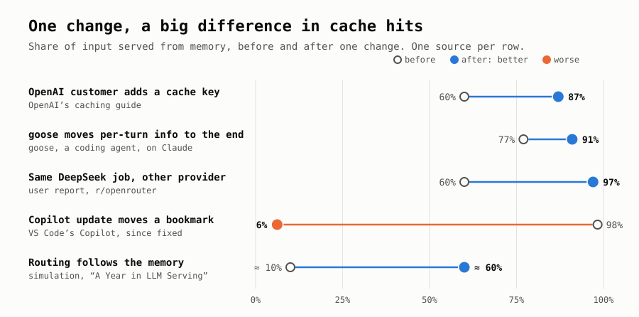

The rows come from OpenAI's caching guide, the goose and VS Code Copilot projects, a user report and the serving study above. A large benchmark, Claw-SWE-Bench, found that on the same model, the choice of harness alone moved the share from memory by up to about 30 points ([arXiv 2606.12344](https://arxiv.org/pdf/2606.12344)).

**4. A good average can still hide a big bill.** Remember that saving into memory costs extra. A long conversation that has to be saved from scratch once or twice can cost more than thousands of cheap re-reads:

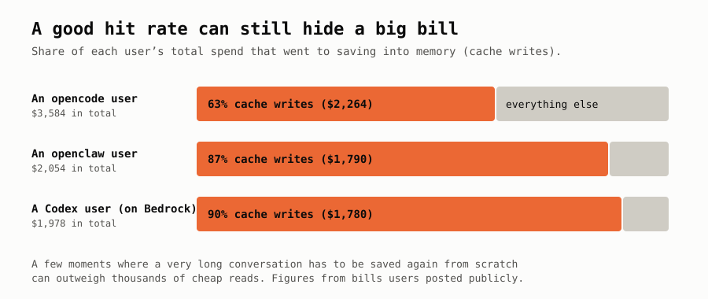

These come from users who posted their bills publicly.

**5. Once memory works, the number of steps is what costs money.** At 95%+ from memory, the bill is mostly re-reads, and every extra step re-reads the whole conversation. The FreeInference researchers' advice to harness builders: *"reduce the number of steps rather than input per turn."* They also found the model is no longer what makes agents slow. Doubling the speed of the tools (tests, builds, searches) would speed agents up 1.38×, against only 1.10–1.16× for a faster model.

---

## Part 4: Four ways of thinking about the same problem

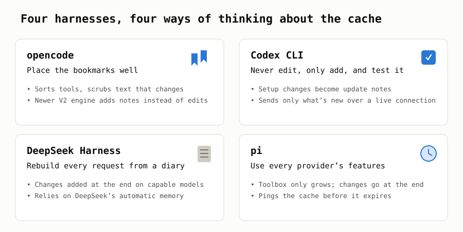

The four harnesses start from different ideas:

- **opencode** places good bookmarks on a conversation it rebuilds each step, and is moving toward freezing the start.
- **Codex** treats "never edit, only add" as a rule, and tests it.
- **DeepSeek Harness** builds that rule into how it stores conversations.
- **pi** uses every feature each provider offers, then spends a little to keep the memory from expiring.

Most of them, and others like Claude Code and goose, are converging on the same rule:

> **Never edit what you've already sent. Add changes at the end.**

Getting 95%+ of a conversation from memory is no longer hard. The money that's left is in rare, expensive moments that an average hides: summarising, resuming a session, starting helper agents, and memory expiring during a long pause. The next round of improvements is about making those moments memory-friendly, and about finishing tasks in fewer steps.
